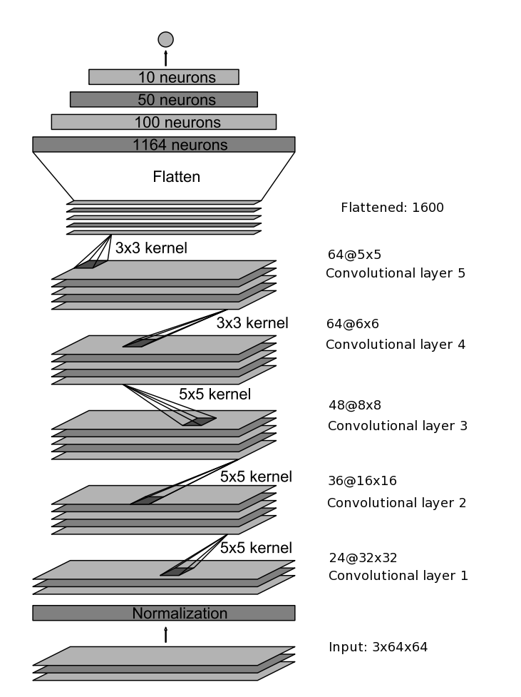

# Behavioral Cloning Project (P3)
Behavioral cloning project for Self Driving Car Nanodegree

## Entry Criteria
* Python 3.5 Installed
* [Anaconda Installation](https://www.continuum.io/downloads) - Useful for Rapid Prototyping using iPython Notebooks
* Udacity's Self Driving Car simulator - Beta Version recommended

### Training in Simulator
Training requires data generated using the simulator from Udacity(Beta Version recommended):
- Image data captured under the IMG directory with left, right and center prefixes for images captured by 3 cameras(Left, Center, Right) mounted on the car
- driving_log.csv file captures throttle, steering angle, brake, speed and image index for left, center and right images

### Training the model
To start the training:
* Input: Locations of driving_log.csv and IMG directory
* Processing: Run `python model.py`
* Output: Model and weights are written to model.h5 file

## Testing
* Open Udacity's simulator
* Run `python drive.py model.h5`


## Obtaining training data
The training data is generated using the graphical simulator provided. The three training approaches followed are detailed below:
* Approach 1: Data captured from simulator using training mode on Beginner track. This approach ended up in a model prone to errors as the recording picked up the bad behaviors of veering out of the track a little bit.
* Approach 2: Data capture on Advanced track was very difficult to train the model. But the data used to train from Approach 1 made the car go round this track successfully.
* Approach 3: Using the sample data provided by Udacity as data.zip. This approach yielded better training data as bad behaviors have been found to be minimal.The trained model cloned good behavior very well and the car completed at least a few laps successfully

I have chosen the "Approach 3" using the training data provided by Udacity. This provided better accuracy and less jitteriness on the track while the car was moving on both Beginner and Advanced tracks provided.

## Architecture
My overall strategy initially was to transfer the best practices from an already trained model architecture. Although my initial approach was to adopt models and best practices learnt from previous lessons, the increase in complexity would require more computing power. After driving the car in training mode, I have decided that optimal size of training data to fulfill the test in simulator would be in the range of 5000-25000 images.

My initial step was to search the optimal design involving Convolutional Neural Network as they have been proven to train the entire processing pipeline to steer and automobile. The discussions in confluence have lead to a well known network architecture by NVIDIA described in this white [paper](http://images.nvidia.com/content/tegra/automotive/images/2016/solutions/pdf/end-to-end-dl-using-px.pdf).

 The architecture of the network is the same as detailed in the paper, except our inputs are 64x64, so
 our network has a total of 2,116,983 params.

 

This architecture performed very well without any further modifications. The following practices helped in coming up with solution that met my expectations:

* Adding header to label the CSV log file data generated from simulator.
* Adam optimizer with an initial learning rate of .0001 is used for training.
* The training data was loaded from CSV file into memory identifying left, center and right images including the telemetry data like steering and throttle.
* This data is then shuffled and split into training and validation set allowing to compare the training and validation loss to reduce mse leading to tweaks in network to avoid overfitting.
* The sizes trained in the final model as detailed below:
```
Image Count: 24108
Training Size: 16876
Validation Size: 7232
```

## Data preprocessing
Cropping of images resulted in enhanced behavior to focus on the center of the track even when the car touches the edges of the track.

Also avoiding the data points in the training set where car ended up in the following events:
* Crashed
* Stuck on the sides
* Drives off road

## Data enhancements
* Added header record "center,left,right,steering,throttle,brake,speed" manually to the trained data from simulator
The sample image enhancements performed during the training are given below.
[//]: # (Image References)
[image2]: (./random_original_image.png) "Random Normal Image"
[image3]: (./random_shear_image.png) "Sheared Image"
[image4]: (./cropped_image.png) "Cropped Image"
[image5]: (./flipped_image.png) "Flipped Image"
[image7]: (./beightness_or_grayscale.png) "Brightness Image"


## Conclusions
In a nutshell, its possible to clone the behavior by re-using models from NVIDIA and other white papers. Experimenting with additional layers and dropouts was interesting, but the model selected from the white paper was found to be more effective in reducing the loss. Overtraining the network did not improve the results as expected. Approaches to use different sets of training data on difficult tracks did result in bad behavior cloned leading to car getting stuck in the middle of the track.  The ideal scenario I found effective was to go slow while training on the easy track using simulator to ensure the car remained in the middle of track. While driving the throttle and other parameters could be tweaked to ensure behavior was copied effectively.
