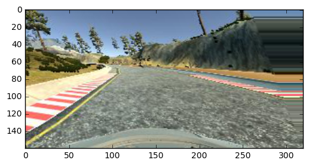
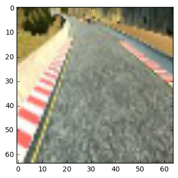
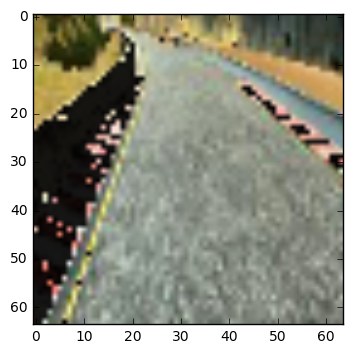

#**Behavioral Cloning Project P3**

##Pre-requisites
* Python 3.5 Installed
* [Anaconda Installation](https://www.continuum.io/downloads) - Useful for Rapid Prototyping using iPython Notebooks
* Udacity's Self Driving Car simulator - Beta Version recommended

**Behavioral Cloning Project**

The goals / steps of this project are the following:
* Use the simulator to collect data of good driving behavior
* Build a multilayered neural network in Keras that predicts steering angles from images
* Train and validate the model with a training and validation set
* Test that the model successfully drives around track one without leaving the road
* Summarize the results with a written report


[//]: # (Image References)
[image1]:  "Model Visualization"
[image2]:  "Random Normal Image"
[image3]:  "Sheared Image"
[image4]:  "Cropped Image"
[image5]:  "Flipped Image"
[image7]:  "Brightness Image"

## Rubric Points
###Here I will consider the [rubric points](https://review.udacity.com/#!/rubrics/432/view) individually and describe how I addressed each point in my implementation.  

---
###Files Submitted & Code Quality

####1. Submission includes all required files and can be used to run the simulator in autonomous mode

My project includes the following files:
* model.py containing the script to create and train the model
* drive.py for driving the car in autonomous mode
* model.h5 containing a trained convolution neural network
* writeup_report.md or writeup_report.pdf summarizing the results

####2. Submssion includes functional code
Using the Udacity provided simulator and my drive.py file, the car can be driven autonomously around the track by executing
```
python drive.py model.h5
```

####3. Submssion code is usable and readable

The model.py file contains the code for training and saving the convolution neural network. The file shows the pipeline I used for training and validating the model, and it contains comments to explain how the code works.

###Model Architecture and Training Strategy

####1. An appropriate model arcthiecture has been employed

The model built in the project is based on well known network architecture the NVIDIA white [paper](http://images.nvidia.com/content/tegra/automotive/images/2016/solutions/pdf/end-to-end-dl-using-px.pdf).

 The architecture of the network is the same as detailed in the paper above.

 

####2. Attempts to reduce overfitting in the model
The model was trained and validated on different data sets to ensure that the model was not overfitting. The model was tested by running it through the simulator and ensuring that the vehicle could stay on the track.

####3. Model parameter tuning
The model used an adam optimizer, so the learning rate was not tuned manually (model.py line 200).

####4. Appropriate training data
The training data has been generated using the approaches described below.

###Model Architecture and Training Strategy

####1. Solution Design Approach
My initial architecture started had 5 layers modeled from previous labs which ended up being erroneous. After experimenting and suggestions in confluence about using NVIDIA model described in this white [paper](http://images.nvidia.com/content/tegra/automotive/images/2016/solutions/pdf/end-to-end-dl-using-px.pdf). I have decided to try this approach and found some improvements through training different datasets.

####2. Final Model Architecture
The final model consisted of the following layers:
- Input layer: 64x64x3 images
- Convolutional: 24 filters (5,5), strides=(2, 2), 'same' padding
- Max Pooling: 2x2, strides=(1,1)

- Convolutional: 36 filters (5x5), strides=(2, 2), 'same' padding
- Max Pooling: 2x2, strides=(1,1)

- Convolutional 48 filters (5x5), strides=(2, 2), 'same' padding
- Max Pooling: 2x2, strides=(1,1)

- Convolutional 64 filters (3x3), strides=(1, 1), 'same' padding
- Max Pooling: 2x2, strides=(2,2)

- Convolutional 64 filters (3x3), strides=(1, 1), 'same' padding
- Max Pooling: 2x2, strides=(2,2)

- Flattening layer
- Fully connected (1164)
- Dense (100)
- Dense (50)
- Dense (10)
- Output: Dense (1)

The diagram below describes the architecture described above.


####3. Creation of the Training Set & Training Process
The approach followed to capture training data has been described below:
* Approach 1: Data captured from simulator using training mode on Beginner first track. This approach ended up in a model prone to errors as the recording picked up the bad behaviors of veering out of the track a little bit.
* Approach 2: Data capture on Advanced second track was very difficult to train the model. But the data used to train from Approach 1 made the car go round the track successfully.
* Approach 3: Using the sample data provided by Udacity as data.zip. This approach yielded better training data as bad behaviors have been found to be minimal.The trained model cloned good behavior very well and the car completed at least a few laps successfully

Finally, it pays off to play the simulator well while driving on the track. I felt that data provided by Udacity is better for training. Although my 8 year old training data on beginner track came close to accuracy. I chose data from "Approach 3" for training my model.
